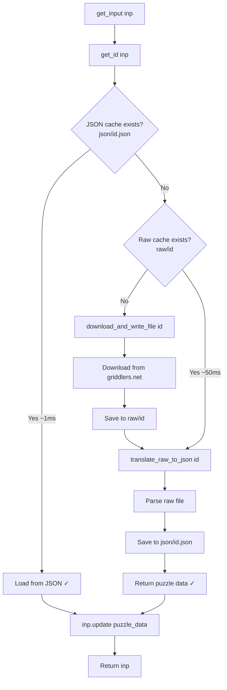
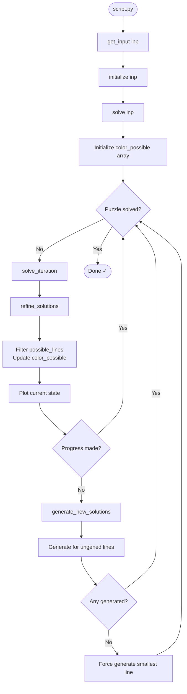
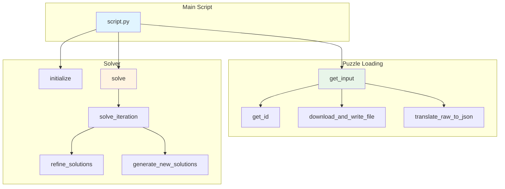
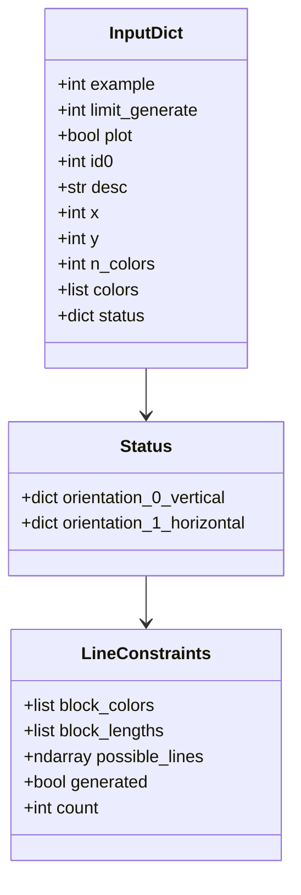
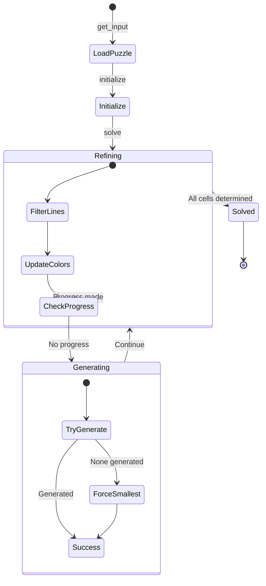

# Call Logic Documentation

## System Overview

The pygriddler system consists of three main components:
1. **Puzzle Loading** - Three-tier caching for puzzle data
2. **Initialization** - Generate initial solution candidates
3. **Solving** - Iterative refinement and generation

## File Structure
```
pygriddler/
├── raw/              # Raw puzzle files from griddlers.net
├── json/             # Parsed puzzle data in JSON format
├── blueprint/        # Reference outputs for validation
├── download.py       # Puzzle loading and caching
├── solution.py       # Solver algorithm
├── script.py         # Main entry point
└── output.txt        # Solver text output
```

---

## 1. Puzzle Loading (download.py)

### Three-Tier Caching Strategy



### Functions

**`get_input(inp)`**
- Orchestrates three-tier caching
- Returns `inp` enhanced with puzzle data

**`get_id(inp)`**
- Maps example number (1-9) → puzzle ID

**`download_and_write_file(id0)`**
- Downloads from griddlers.net → `raw/{id}`

**`translate_raw_to_json(id0)`**
- Parses `raw/{id}` → `json/{id}.json`
- Extracts constraints, colors, dimensions

---

## 2. Solver Architecture (solution.py)

### Main Execution Flow



### Function Call Hierarchy



### Solver Functions

**`initialize(inp)`**
- For each line (row/column):
  - Count possible solutions
  - If count < limit: generate and store all possibilities
  - If count ≥ limit: mark for lazy generation

**`solve(inp)`** - Main coordinator
- Initialize `color_possible` 3D array (y × x × n_colors)
- Run solve_iteration loop until puzzle solved
- Returns when all cells determined

**`solve_iteration(...)`** - One iteration
1. Call `refine_solutions()` 
2. Plot if requested
3. If no progress → call `generate_new_solutions()`
- Returns: updated `color_possible`, `generated`, `worth_checking`

**`refine_solutions(...)`** - Filter existing solutions
- For each generated line:
  - Remove impossible candidates based on color_possible
  - Update color_possible based on remaining candidates
- Uses `worth_checking` to skip unchanged lines
- Returns: `color_possible`, `old`, `worth_checking`

**`generate_new_solutions(...)`** - Create new candidates
- For ungerated lines: try generating with current constraints
- If none succeed: force generate smallest remaining line
- Returns: `color_possible`, `generated` flag

---

## 3. Data Structures

### Input Dictionary



**Input Dictionary Structure:**
```python
inp = {
    # User settings
    "example": int,           # Puzzle number (1-9)
    "limit_generate": int,    # Max solutions to generate
    "plot": bool,             # Show visualization
    
    # Puzzle data (added by get_input)
    "id0": int,               # Puzzle ID
    "desc": str,              # Description
    "x": int,                 # Width
    "y": int,                 # Height  
    "n_colors": int,          # Number of colors
    "colors": list,           # Color palette
    "status": {               # Constraints
        0: {col: {            # Vertical
            "block_colors": [int],
            "block_lengths": [int],
            "possible_lines": ndarray,
            "generated": bool,
            "count": int
        }},
        1: {row: {...}}       # Horizontal
    }
}
```

### Color Possible Array
```python
color_possible[y, x, color] = 0 or 1
# 1 = color is possible at (x,y)
# 0 = color is impossible at (x,y)
```

---

## 4. Algorithm State Machine



---

## 5. Performance Optimization

| Component | Speed | Notes |
|-----------|-------|-------|
| JSON cache | ~1ms | Best case - puzzle already loaded |
| Raw cache | ~50ms | Parse needed but no download |
| Download | ~500ms+ | Network + parse |
| Initialize | Varies | Depends on puzzle complexity |
| Iteration | Varies | Faster when lines pre-generated |

**Optimization Strategy:**
- Generate eagerly when count < limit (5M by default)
- Generate lazily with constraints for large counts
- Skip unchanged lines using `worth_checking` flags
- Cache at JSON level for instant reload
