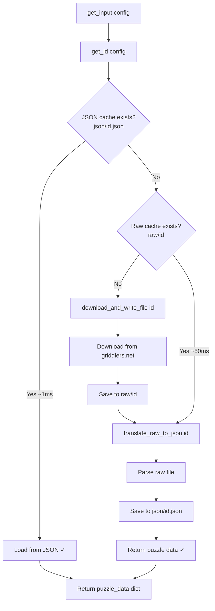
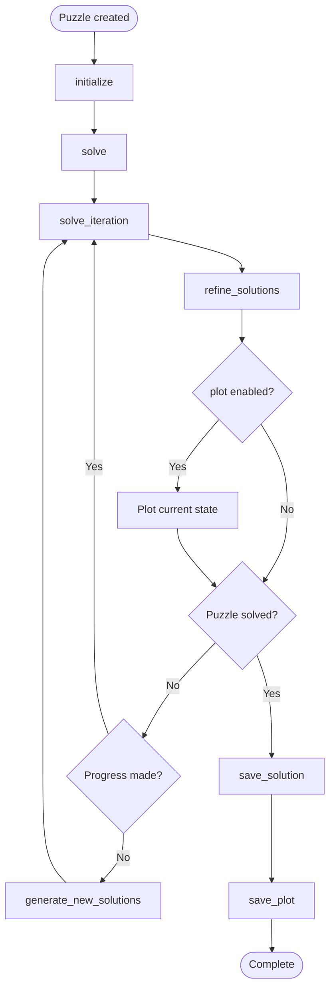

# PyGriddler Architecture

This document describes the system architecture, call flow, and internal workings of the PyGriddler nonogram solver.

## System Overview

PyGriddler consists of four main components:

1. **Puzzle Loading** (`download.py`) - Three-tier caching for puzzle data
2. **Puzzle Class** (`puzzle.py`) - Main solver orchestration and state management
3. **Line Solving** (`puzzle_line.py`) - Individual row/column constraint tracking
4. **Generation** (`generators.py`) - Candidate solution generation algorithms

## File Structure

```
pygriddler/
├── download.py       # Puzzle loading and caching system
├── puzzle.py         # Puzzle class - main solver
├── puzzle_line.py    # PuzzleLine class - constraint tracking
├── generators.py     # Solution generation (cached recursive algorithms)
├── utils.py          # Plotting, logging, and helper functions
├── script.py         # Main entry point
├── test.py           # Testing utilities
├── raw/              # Raw puzzle files from griddlers.net
├── json/             # Parsed puzzle data in JSON format
├── blueprint/        # Reference outputs for validation
└── solutions/
    └── python/       # Solver outputs (.npy, .json, .png)
```

---

## 1. Puzzle Loading (download.py)

### Three-Tier Caching Strategy



### Functions

#### `get_input(config: dict) -> dict`
Orchestrates the three-tier caching system to load puzzle data.

**Parameters:**
- `config`: Dictionary with `example` (puzzle ID or 1-9) and other settings

**Returns:**
- `puzzle_data`: Dictionary containing:
  - `id0`: Puzzle ID
  - `desc`: Description (title, dimensions, colors)
  - `x`, `y`: Width and height
  - `n_colors`: Number of colors
  - `colors`: List of color values
  - `status`: Dictionary with `"vertical"` and `"horizontal"` keys, each containing PuzzleLine objects

**Cache Levels:**
1. **JSON** (`json/{id}.json`): ~1ms - Direct load
2. **Raw** (`raw/{id}`): ~50ms - Parse required
3. **Download**: ~500ms+ - Network + parse

#### `get_id(config: dict) -> int`
Maps example number (1-9) to puzzle ID, or returns direct ID.

#### `download_and_write_file(id0: int) -> None`
Downloads puzzle from griddlers.net and saves to `raw/{id}`.

#### `translate_raw_to_json(id0: int) -> dict`
Parses raw puzzle file and saves to `json/{id}.json`.

**Parsing Logic:**
- Extracts dimensions (x, y)
- Parses color palette
- Extracts row and column constraints (block colors and lengths)
- Creates PuzzleLine objects for each row/column

---

## 2. Puzzle Class (puzzle.py)

The `Puzzle` class encapsulates all puzzle state and solving logic.

### Class Structure

```python
class Puzzle:
    # Metadata
    id0: int              # Puzzle ID
    desc: str             # Description
    x: int                # Width
    y: int                # Height
    n_colors: int         # Number of colors
    colors: list          # Color palette
    limit_generate: int   # Max solutions to generate eagerly
    
    # State
    color_possible: np.ndarray  # (y, x, n_colors) - color possibilities
    status: dict                # {"vertical": {idx: PuzzleLine}, 
                                #  "horizontal": {idx: PuzzleLine}}
```

### Solving Flow



### Key Methods

#### `__init__(puzzle_data: dict, limit_generate: int = 5_000_000)`
Initialize puzzle from parsed data.

#### `initialize() -> None`
Initialize puzzle lines and generate initial solutions.

**For each line:**
1. Count possible solutions using `generate_count()`
2. If count < `limit_generate`:
   - Generate all solutions with `generate()`
   - Mark as `generated = True`
   - Store in `possible_lines`
3. If count ≥ `limit_generate`:
   - Mark as `generated = False`
   - Defer generation until needed

#### `solve(do_plot: bool = False) -> None`
Main solving loop - runs until puzzle is solved or no progress can be made.

**Algorithm:**
```python
while not is_solved():
    refine_solutions()
    if do_plot:
        plot_current_state()
    if no_progress:
        generate_new_solutions()
```

#### `solve_iteration(it: int, do_plot: bool) -> tuple`
Performs one iteration of the solving algorithm.

**Returns:** `(color_possible, generated, worth_checking)`

#### `refine_solutions() -> tuple`
Filter existing solutions based on current color constraints.

**For each generated line:**
1. Extract current color possibilities for that line
2. Filter `possible_lines` to keep only valid candidates
3. Update `color_possible` based on remaining candidates
4. Mark unchanged lines to skip in future iterations

**Returns:** `(color_possible, old, worth_checking)`

#### `generate_new_solutions() -> tuple`
Generate new solutions for ungerated lines using current constraints.

**Strategy:**
1. Try generating with constraints for all ungerated lines
2. If no line could be generated:
   - Find the smallest ungerated line
   - Force generate it without constraints
   - Mark as generated

**Returns:** `(color_possible, any_generated)`

#### `is_solved() -> bool`
Check if puzzle is completely solved (all cells have exactly one possible color).

#### `extract_row(ori: str, idx: int, color: int) -> np.ndarray`
Extract a slice of `color_possible` for a specific orientation, index, and color.

**Parameters:**
- `ori`: `"vertical"` or `"horizontal"`
- `idx`: Row or column index
- `color`: Color index

**Returns:** 1D array of possibilities for that line and color

#### `extract_row_2(ori: str, idx: int) -> np.ndarray`
Extract a slice of `color_possible` for all colors.

**Returns:** 2D array (length × n_colors)

#### `apply_line_constraints(ori: str, line: int, line_status: PuzzleLine) -> None`
Apply constraints from a PuzzleLine to update `color_possible`.

#### `save_solution() -> None`
Save solved puzzle to `solutions/python/{id}.npy` and `.json`.

#### `save_plot() -> None`
Save visualization to `solutions/python/png/{id}.png`.

---

## 3. PuzzleLine Class (puzzle_line.py)

Tracks the state of a single row or column.

### Class Structure

```python
class PuzzleLine:
    _block_colors: tuple       # Color of each block (e.g., (1, 2, 1))
    _block_lengths: tuple      # Length of each block (e.g., (3, 5, 2))
    _n_colors: int             # Total number of colors in puzzle
    _possible_lines: np.ndarray | None  # All valid solutions (2D array)
    _generated: bool           # Whether solutions have been generated
    _count: int                # Number of possible solutions
```

### Key Methods

#### `get_allowed_colors(color_possible_slice: np.ndarray) -> list`
Compute which colors are still possible at each position.

**Performance Critical:** This is one of the main bottlenecks.

**Algorithm:**
1. Extract unique values across all possible lines
2. Filter by `color_possible_slice` constraints
3. Return list of allowed colors per position

#### `filter_possible_lines(color_possible_slice: np.ndarray) -> int`
Remove invalid candidates based on current color constraints.

**Returns:** Number of lines removed

#### `update_color_possible(color_possible_slice: np.ndarray) -> int`
Update color possibilities based on remaining valid lines.

**Returns:** Number of changes made

---

## 4. Generators (generators.py)

Recursive algorithms for generating valid line solutions.

### Core Functions

All generator functions use `@cache` decorator for memoization.

#### `generate(n, block_lengths, block_colors, previous_color) -> np.ndarray`
Generate all possible valid arrangements of blocks in a line.

**Parameters:**
- `n`: Length of line
- `block_lengths`: Tuple of block sizes
- `block_colors`: Tuple of block colors
- `previous_color`: Color of previous block (for spacing rules)

**Returns:** 2D array where each row is a valid line configuration

**Algorithm:**
```python
if no blocks left:
    return line of zeros (white)
for each possible position of first block:
    recursively generate rest of line
    concatenate: [whites] + [block] + [recursive_result]
return all combinations
```

#### `generate_count(n, block_lengths, block_colors, previous_color) -> int`
Count possible arrangements without generating them (faster).

#### `generate_with_info(n, block_lengths, block_colors, previous_color, info) -> np.ndarray`
Generate with additional constraints from `color_possible`.

**Parameters:**
- `info`: Tuple of allowed colors at each position

**Returns:** Filtered array of valid lines

#### `generate_color_possible(n, block_lengths, block_colors, previous_color) -> np.ndarray`
Generate a `color_possible`-style output showing which colors are possible at each position.

**Returns:** 2D array (n × max_color) of possibilities

### Caching Strategy

All `@cache` decorated functions use tuple arguments for hashability:
- Lists converted to tuples with `totuple()` utility
- Dramatic speedup from avoiding repeated calculations
- Memory trade-off for large puzzles

---

## 5. Data Structures

### Puzzle Data Dictionary

```python
puzzle_data = {
    "id0": int,           # Puzzle ID from griddlers.net
    "desc": str,          # "Title WxHxC\nID"
    "x": int,             # Width
    "y": int,             # Height
    "n_colors": int,      # Number of colors (including white)
    "colors": list,       # Color values [white, color1, color2, ...]
    "status": {
        "vertical": {     # Column constraints
            0: PuzzleLine(block_colors=(1,2), block_lengths=(3,5), ...),
            1: PuzzleLine(...),
            ...
        },
        "horizontal": {   # Row constraints
            0: PuzzleLine(...),
            ...
        }
    }
}
```

### color_possible Array

3D NumPy array tracking color possibilities:

```python
color_possible: np.ndarray  # Shape: (y, x, n_colors)

# Access pattern
color_possible[row, col, color] = 0 or 1
# 1 = color is possible at (col, row)
# 0 = color is ruled out at (col, row)

# Example: Check if color 2 is possible at (5, 3)
if color_possible[3, 5, 2]:
    print("Color 2 is possible at column 5, row 3")
```

### possible_lines Array

2D NumPy array of valid line configurations:

```python
possible_lines: np.ndarray  # Shape: (n_candidates, line_length)

# Each row is a valid configuration
# Example for a 10-cell line with 3 candidates:
# [[0, 0, 1, 1, 1, 0, 2, 2, 0, 0],   # Candidate 1
#  [0, 1, 1, 1, 0, 0, 2, 2, 0, 0],   # Candidate 2
#  [0, 1, 1, 1, 0, 2, 2, 0, 0, 0]]   # Candidate 3
```

---

## 6. Algorithm Details

### Constraint Propagation

The solver uses **arc consistency** principles:

1. **Initialize**: Generate or count solutions for each line
2. **Propagate**: For each line with generated solutions:
   - Remove invalid candidates based on perpendicular constraints
   - Update color possibilities based on remaining candidates
3. **Iterate**: Repeat until no changes occur
4. **Generate**: If stuck, generate solutions for more lines and continue

### Worth Checking Optimization

To avoid redundant work, the solver tracks which lines need rechecking:

```python
worth_checking = {
    "vertical": set(),    # Columns that changed
    "horizontal": set()   # Rows that changed
}

# Only process lines in worth_checking sets
# After processing, mark perpendicular lines as worth_checking
```

### Generation Strategy

**Eager Generation** (during `initialize`):
- For lines with `count < limit_generate`
- Generates all solutions upfront
- Faster solving but slower initialization

**Lazy Generation** (during `generate_new_solutions`):
- For lines with `count >= limit_generate`
- Attempts generation with current constraints
- Falls back to forcing smallest line if stuck

### Performance Bottlenecks

Based on profiling output in `script.py`:

1. **Calculating unique** (`_time_unique`): Finding unique color values across candidates
2. **Calculating keep** (`_time_keep`): Filtering valid candidates

These operations occur in `PuzzleLine.get_allowed_colors()` and `filter_possible_lines()`.

---

## 7. Execution Flow

### Complete Call Graph

```
script.py
  └─ get_input(config)                    [download.py]
       ├─ get_id(config)
       ├─ translate_raw_to_json(id)
       │    └─ parse raw file → PuzzleLine objects
       └─ return puzzle_data
  
  └─ Puzzle(puzzle_data, limit_generate)  [puzzle.py]
       └─ __init__: initialize color_possible
  
  └─ puzzle.initialize()
       └─ For each line:
            ├─ generate_count()            [generators.py]
            └─ generate() if count < limit
  
  └─ puzzle.solve(do_plot)
       └─ while not is_solved():
            ├─ refine_solutions()
            │    └─ For each generated line:
            │         ├─ extract_row()
            │         ├─ line_status.filter_possible_lines()
            │         │    └─ Check against color_possible
            │         └─ line_status.update_color_possible()
            │              └─ Update based on remaining lines
            │
            ├─ plot() if do_plot           [utils.py]
            │
            └─ generate_new_solutions() if no progress
                 └─ For ungerated lines:
                      ├─ generate_with_info()  [generators.py]
                      └─ Force smallest if none succeed
  
  └─ puzzle.save_solution()
  └─ puzzle.save_plot()
```

### State Machine

```mermaid
stateDiagram-v2
    [*] --> Loading: get_input
    Loading --> Initializing: Puzzle()
    Initializing --> CountingSolutions: initialize()
    
    state CountingSolutions {
        [*] --> CountLine
        CountLine --> CheckCount{count < limit?}
        CheckCount --> GenerateEager: Yes
        CheckCount --> MarkLazy: No
        GenerateEager --> NextLine
        MarkLazy --> NextLine
        NextLine --> [*]
    }
    
    CountingSolutions --> Solving: solve()
    
    state Solving {
        [*] --> Refining
        
        state Refining {
            [*] --> FilterLines
            FilterLines --> UpdateColors
            UpdateColors --> [*]
        }
        
        Refining --> CheckSolved{Solved?}
        CheckSolved --> [*]: Yes
        CheckSolved --> CheckProgress{Progress?}: No
        CheckProgress --> Refining: Yes
        
        CheckProgress --> Generating: No
        
        state Generating {
            [*] --> TryWithConstraints
            TryWithConstraints --> Success: Generated
            TryWithConstraints --> ForceSmallest: Failed
            ForceSmallest --> Success
        }
        
        Generating --> Refining
    }
    
    Solving --> Saving: is_solved()
    Saving --> [*]
```

---

## 8. Performance Optimization

### Caching Levels

| Cache Level | Location | Speed | Use Case |
|-------------|----------|-------|----------|
| JSON | `json/{id}.json` | ~1ms | Repeated solves of same puzzle |
| Raw | `raw/{id}` | ~50ms | Re-parse after JSON deletion |
| Download | griddlers.net | ~500ms+ | First-time puzzle access |
| Generation | `@cache` | Instant | Repeated generation calls |

### Memory vs. Speed Tradeoffs

**limit_generate** parameter:

- **High (5M+)**: 
  - More eager generation
  - Higher memory usage
  - Faster solving
  
- **Low (100K)**:
  - More lazy generation
  - Lower memory usage
  - Slower solving (more generation during solve)

### Optimization Opportunities

1. **Parallel Processing**: Lines can be refined independently
2. **Smarter Generation Order**: Generate most constrained lines first
3. **Better Unique Calculation**: Current bottleneck in `get_allowed_colors()`
4. **Incremental Updates**: Track which cells changed instead of full passes

---

## 9. Testing and Validation

### Blueprint Validation

Blueprint files in `blueprint/` directory contain reference outputs for validation.

### Example Usage

See [script.py](../script.py) for complete example with timing and diagnostics.

---

## Summary

PyGriddler uses a combination of:
- **Constraint propagation** (refine existing solutions)
- **Intelligent generation** (eager vs. lazy based on complexity)
- **Caching** (puzzle data, generated solutions)
- **Optimization** (worth_checking sets, memoization)

to efficiently solve multi-color nonogram puzzles.
